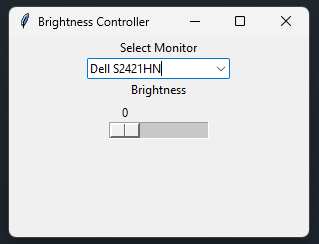

# Monitor Brightness Controller for Windows

```python
import screen_brightness_control as sbc

# List all connected monitors
monitors = sbc.list_monitors()

message = ["Choose monitor:"]

for index, monitor in enumerate(monitors):
    try:
        message.append(f"{index}. {monitor}")
    except Exception as e:
        print(f"Failed to append {monitor} monitor on message")


print("Detected monitors:")
for index, monitor in enumerate(monitors):
    print(f"{index}. {monitor}")

try:
    monitor_index = int(input("Choose monitor index: "))
    if 0 <= monitor_index < len(monitors):
        monitor = monitors[monitor_index]
        try:
            b = int(input(f"Enter brightness for {monitor} (0-100): "))
            if 0 <= b <= 100:
                sbc.set_brightness(b, display=monitor)
                print(f"Set brightness to {b}% for {monitor}")
            else:
                print("Brightness must be between 0 and 100")
        except ValueError:
            print("Invalid brightness input")
    else:
        print("Invalid monitor index")
except ValueError:
    print("Invalid index input")

# Optionally, get current brightness of all monitors
for monitor in monitors:
    try:
        current = sbc.get_brightness(display=monitor)
        print(f"Current brightness for {monitor}: {current}%")
    except Exception as e:
        print(f"Could not read brightness for {monitor}: {e}")
```

## Tkinter user interface


